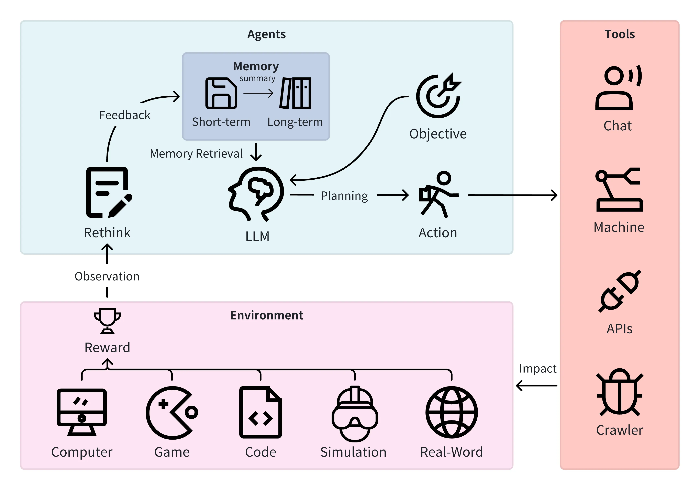
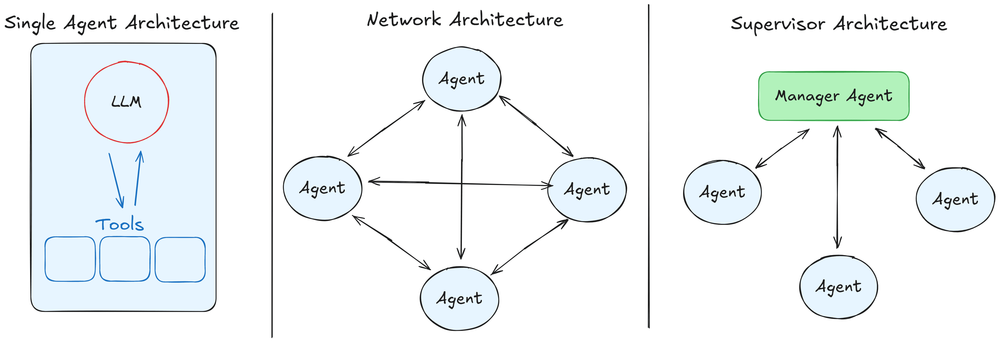
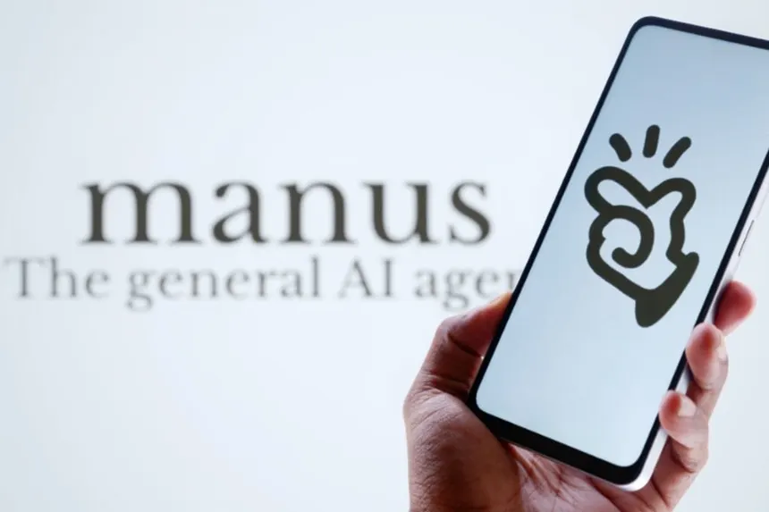

## Introduzione

Gli agenti AI sono diventati un tema di grande interesse nell'ultimo anno, con notevoli investimenti da parte delle principali aziende tecnologiche. Sebbene siamo ancora nelle prime fasi di sviluppo, è evidente che questa tecnologia abbia un potenziale superiore rispetto ai semplici tool che consentono attività specifiche come la ricerca web o l'esecuzione di codice.

La definizione precisa di agente AI nel contesto degli LLM non è ancora universalmente condivisa, poiché il concetto è in continua evoluzione. Tuttavia, in generale, un agente è considerato un LLM che, supportato da un'infrastruttura software, è in grado di pianificare, prendere note, gestire liste di attività e adattarsi dinamicamente utilizzando vari strumenti, incluso interagire direttamente con l'ambiente reale.

## Cos'è un Agente AI

Sebbene modelli come ChatGPT e Claude abbiano capacità di pianificazione e utilizzo di strumenti, il termine agente viene tipicamente riservato a sistemi più avanzati, capaci di gestire autonomamente compiti complessi e articolati.

Un agente AI opera secondo un ciclo definito: riceve un input, ragiona sul compito, pianifica una strategia, sceglie gli strumenti appropriati, esegue l'azione e valuta il risultato. Se non raggiunge l'obiettivo, ripete il processo, adattandosi di conseguenza. Questa capacità di problem-solving autonomo rende gli agenti strumenti potenti per automazioni complesse.

Gli agenti AI hanno anche una notevole capacità di adattamento. Se una strategia o una fonte non funzionano come previsto, possono autonomamente cercare alternative, ricalibrare la pianificazione e continuare a operare fino a raggiungere l'obiettivo.

{width=80% fig-align="center"}

## Limiti e Importanza del "Human in the loop"

Nonostante le loro potenzialità, gli agenti AI necessitano sempre della supervisione umana ("human in the loop"). Delegare completamente compiti lunghi o complessi agli agenti senza controllo è tecnicamente rischioso, come dimostra chiaramente l'incidente di Replit (luglio 2025), in cui un agente ha causato la perdita di dati critici ignorando direttive esplicite.
https://www.businessinsider.com/replit-ceo-apologizes-ai-coding-tool-delete-company-database-2025-7

Pertanto, gli agenti devono essere utilizzati per compiti che possano essere eseguiti autonomamente e successivamente verificati da una persona, come ricerche approfondite o sviluppo di codice. La supervisione umana rimane indispensabile per evitare errori gravi.

In particolare, gli agenti AI utilizzati per compiti tecnici, come la scrittura di codice complesso, devono essere accuratamente supervisionati e verificati dagli utenti, in quanto eventuali errori potrebbero portare a gravi conseguenze operative.

## Sistemi Multi-Agent

I sistemi multi-agent, in cui più agenti collaborano su attività complesse, sono attualmente oggetto di ricerca sperimentale. Esistono principalmente due tipi di architetture:

- **Coordinatore centrale:** Un agente assegna compiti e raccoglie risultati.
    
- **Distribuita:** Gli agenti collaborano direttamente senza coordinatore centrale.
    

Questi sistemi, pur interessanti, sono lontani da applicazioni pratiche affidabili a causa della complessità aggiuntiva nella coordinazione e gestione degli errori.

{width=100% fig-align="center"}

## Le Deep Research: Caso d'Uso di Successo

Le Deep Research rappresentano uno dei casi d'uso più efficaci degli agenti AI perché operano in un dominio ben definito, ovvero la raccolta e l'analisi approfondita di informazioni. A differenza delle semplici ricerche online, che solitamente consultano poche fonti e rispondono velocemente, le Deep Research seguono un approccio molto più articolato e strategico.

Durante una Deep Research, l'agente definisce inizialmente un piano di ricerca dettagliato, seleziona e consulta numerose fonti, le analizza in profondità, confronta criticamente i dati raccolti e li sintetizza in un report completo e accurato. Tale processo può richiedere tempi relativamente lunghi (anche mezz'ora o più per singola ricerca), ma assicura un risultato notevolmente superiore in termini di qualità e approfondimento.

Nonostante l'efficacia, anche le Deep Research presentano limiti importanti: possono infatti commettere errori, citare fonti inesistenti o interpretare erroneamente i dati. Pertanto, i risultati devono sempre essere verificati con cura da un operatore umano, specialmente in contesti critici o decisioni importanti.

## Computer Use: Potenzialità, Rischi ed Esempi Avanzati

Gli agenti che usano direttamente il computer, imitando le azioni umane (cliccare, digitare, navigare applicazioni), offrono un grande potenziale, specialmente in situazioni dove non sono disponibili API o integrazioni software. Tuttavia, concedere agli agenti il controllo diretto di un sistema comporta rischi elevati, come evidenziato dall'incidente di Replit, indicando che tale tecnologia non è ancora pronta per un utilizzo sicuro e generalizzato.

Tra gli esempi più avanzati e general-purpose di agenti AI che sfruttano questo approccio troviamo:

- **ChatGPT Agents** ([chatgpt.com](https://chatgpt.com/)): Si distingue per la sua interfaccia che mostra una **riproduzione** delle sue azioni, rendendolo ottimo per ricerche complesse, comparazioni e creazione di documenti.

- **Manus** ([manus.ai](https://www.manus.ai/)): Eccelle nella creazione e pubblicazione di intere **applicazioni web**, ma è anche molto abile nell'analisi e comparazione di dati.

- **Genspark Super Agente** ([genspark.ai](https://www.genspark.ai/)): Si concentra sulla **creazione di contenuti**, offrendo una suite di strumenti specifici per generare di tutto, dai fogli di calcolo ai podcast.

{width=80% fig-align="center"}

## Stato Attuale: Tecnologia in Evoluzione

Gli agenti AI sono una tecnologia emergente ancora non pienamente definita, con notevoli capacità ma anche significativi limiti. Funzionano meglio in contesti controllati e verificabili, come nelle Deep Research.

Il futuro degli agenti AI sarà determinato dalla capacità di bilanciare automazione e controllo umano, garantendo che questi strumenti potenzino le capacità umane senza sostituire completamente il giudizio e la supervisione umana.

La regola fondamentale resta: gli agenti AI sono strumenti potenti, ma sempre sotto la guida e il controllo di esseri umani competenti.
