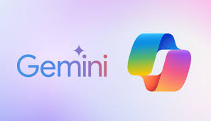
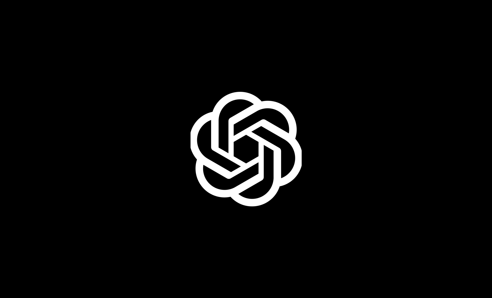

| **CRITERIO** | **ChatGPT** | **Claude** | **Gemini** | **Copilot** | **Perplexity** | **Mistral** |
|--------------|-------------|------------|------------|-------------|----------------|-------------|
| **PREZZO CONSUMER** | €23/mese | €18/mese | €19.99/mese | - | €20/mese | €15/mese |
| **PREZZO BUSINESS** | €29/utente (min 2) | €23/utente (min 5) | €14/utente | €36/utente | €40/utente | €25/utente (min 2) |
| **DEEP RESEARCH** | Sì (Pro) | Sì | Sì | No | Scarsa | Sì |
| **PROJECTS/WORKSPACE** | Projects | Projects | Gems | Solo agents | Spaces | Projects |
| **CANVAS/ARTIFACTS** | Canvas | Artifacts | Canvas | Pages | No | Canvas |
| **ESECUZIONE CODICE** | Code Interpreter e Canvas | Analisi dati e Artifacts | No (tool sperimentali in Google AI Studio) | Solo Excel | Solo Labs | Sì |
| **GENERAZIONE IMMAGINI** | Sì (4o) | No | Sì | Sì | Solo Labs | Sì |
| **ANALISI VIDEO** | No | No | Nativo | No | No | No |
| **RICERCA WEB** | Sì | Sì | Sì | Sì | Sì | Sì |
| **RT VOICE MODE** | Sì | No | Sì | Sì | No | No |
| **CONTEXT WINDOW** | 128K token | 200K token | 1M token | 128K token | Variabile | 200K token |
| **PRIVACY GDPR** | DPA, no data residency UE | DPA, processing UE/US | EU Data Boundary | EU Data Boundary | DPA, no data residency | Default UE, opt-out US |

---

- <a href="https://openai.com/chatgpt/pricing/#team" target="_blank">ChatGPT Pricing</a>
    
- <a href="https://www.anthropic.com/pricing#team-&-enterprise" target="_blank">Claude Pricing</a>
    
- <a href="https://workspace.google.com/pricing.html?source=gafb-ai-globalnav-en&uj=&uj=gafb-home-def-en&uj=gafb-ai-def-en" target="_blank">Gemini Pricing</a>
    
- <a href="https://www.microsoft.com/en-us/microsoft-365/business/with-copilot-plans-and-pricing" target="_blank">Copilot Pricing</a>
    
- <a href="https://www.perplexity.ai/enterprise/pricing" target="_blank">Perplexity Pricing</a>
    
- <a href="https://mistral.ai/pricing" target="_blank">Mistral Pricing</a>

---

## Come scegliere un LLM per le aziende

### Ecosistemi e provider specializzati

Microsoft e Google offrono LLM direttamente integrati nei loro ambienti di lavoro.

Copilot è integrato nativamente in Excel, PowerPoint, Outlook e Teams. Ad esempio, durante la scrittura di un'email o lavorando in Excel, Copilot sfrutta già il contesto del documento.

Gemini offre una funzionalità simile integrata in Gmail, Drive, Docs and Sheets. L'assistente comprende il contenuto dei documenti e può suggerire miglioramenti direttamente.

{width=50% fig-align="center"}

ChatGPT, Claude e Mistral, invece, sono piattaforme esterne con potenti integrazioni tramite connettori e strumenti avanzati, ma non garantiscono la stessa immediatezza e comodità dell'integrazione nativa.

### Una strategia efficace: ecosistema + specialisti

**Passo 1 - Scegliere la base**:

- Microsoft 365 → Copilot
- Google Workspace → Gemini

L'integrazione nativa ha vantaggi considerevoli, anche se alcuni strumenti integrati presentano limitazioni.

Per esigenze specifiche o funzionalità avanzate non coperte dall'ecosistema, scegliere piattaforme specializzate è la soluzione migliore.

## Quando scegliere gli specialisti

### ChatGPT: la scelta universale

**Vantaggio principale**: massima versatilità.

Include numerosi strumenti: interprete codice per analisi dati, generazione avanzata di immagini, workspace collaborativi, modelli vari. È ideale per team multidisciplinari con necessità diversificate.

{width=40% fig-align="center"}

### Mistral: la scelta europea

**Vantaggio principale**: conformità GDPR e privacy.

I dati vengono ospitati nativamente in Europa, evitando il CLOUD Act USA. Offre prestazioni elevate, canvas, progetti e ricerca avanzata. È consigliato per aziende che gestiscono dati sensibili (sanità, finanza, legale, pubblica amministrazione).

{width=35% fig-align="center"}

### Claude: lo specialista della qualità

**Vantaggio principale**: eccellenza in comprensione e scrittura.

Fornisce un context window di 200K token e un'elevata qualità conversazionale. Gestisce efficacemente documenti complessi e risulta eccellente nella redazione di contenuti accurati e nel supportare decisioni critiche.

{width=25% fig-align="center"}

## Adattarsi al cambiamento

Il mercato LLM evolve rapidamente. Perplexity, ad esempio, ha perso terreno nella ricerca, mentre Mistral è cresciuto rapidamente.

**Strategia consigliata**:

- Mantenere attivi 2-3 provider
- Testare regolarmente nuove soluzioni
- Essere pronti a cambiare rapidamente piattaforma

È opportuno dedicare del tempo periodico alla valutazione di nuove opzioni per mantenere una strategia flessibile e adatta al continuo cambiamento del mercato.