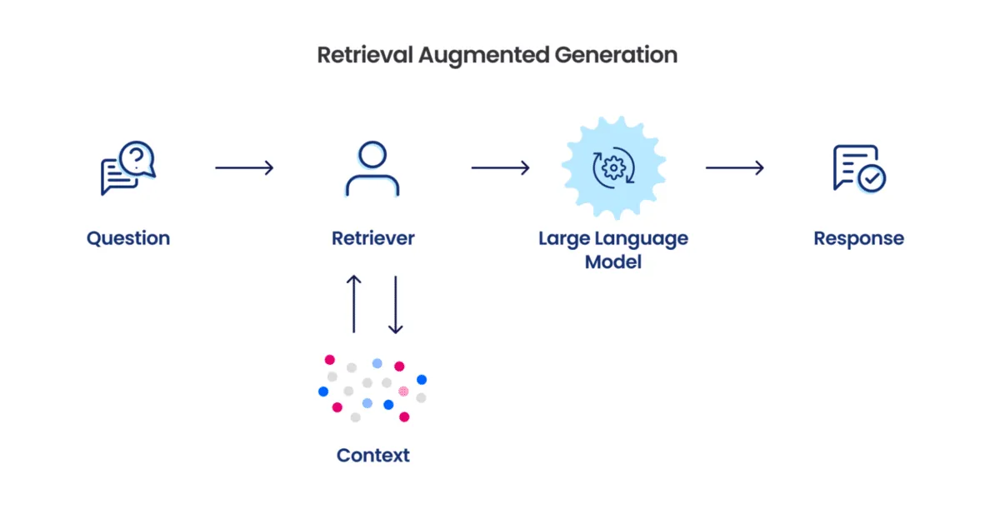
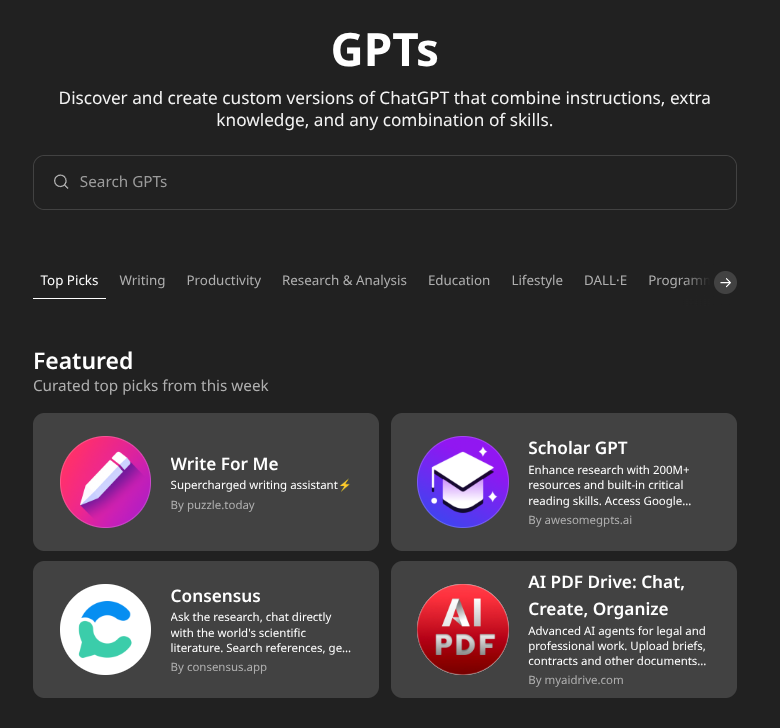

## 1. Il Problema della Personalizzazione

I Large Language Models sono strumenti estremamente potenti ma anche molto generici. Sebbene siano esperti su argomenti come Shakespeare o la fisica quantistica, non conoscono le vostre procedure aziendali, il vostro stile comunicativo o i vostri prodotti specifici. Questa è la sfida centrale della personalizzazione degli LLM: come trasformare un modello generico in un assistente specializzato, capace di comprendere e ragionare nel contesto specifico della vostra organizzazione o ruolo?

Non esiste una risposta univoca. Esistono invece quattro approcci principali, ciascuno con punti di forza e debolezze, costi e livelli di complessità differenti. La scelta dipende da vari fattori: budget, competenze tecniche disponibili, frequenza degli aggiornamenti, volume previsto di utilizzo e strumenti disponibili.

## 2. I Quattro Approcci Fondamentali

### Prompt Engineering

Il prompt engineering è l'approccio più semplice e immediato, basato sul fornire istruzioni precise al modello tramite il prompt, senza modificarlo direttamente. Tecnicamente, fornendo istruzioni influenzate il meccanismo di attenzione del modello, guidandolo verso gli aspetti rilevanti.

La sua forza risiede nell'immediatezza: non richiede competenze tecniche avanzate né infrastrutture complesse. Cambiando il prompt, il comportamento del modello cambia immediatamente. Tuttavia, ogni conversazione riparte da zero poiché il modello non "ricorda" istruzioni tra diverse sessioni. Inoltre, esiste un limite fisico alla quantità di informazioni inseribili nel prompt, determinato dalla context window.

### Long Context

L'approccio long context è un'evoluzione naturale del prompt engineering, basato sull'inserire nel prompt documenti interi. Questa tecnica è resa possibile dall'evoluzione della context window: GPT-3, nel 2020, poteva gestire solo 4.000 token, mentre modelli attuali come Gemini arrivano fino a un milione di token. Tecniche come Flash Attention e sparse attention permettono di mantenere elevata qualità anche con contesti molto ampi.

Con il long context potete includere manuali completi, cataloghi prodotti, procedure aziendali dettagliate, esempi di conversazioni ideali o persino interi libri. Tuttavia, più contesto non significa automaticamente risposte migliori: il fenomeno "Lost in the Middle" può portare il modello a trascurare informazioni poste al centro del contesto. Inoltre, questa tecnica può essere molto costosa, soprattutto per grandi volumi di interazioni giornaliere.

### RAG (Retrieval Augmented Generation)

Il Retrieval Augmented Generation rappresenta un cambio di paradigma rispetto ai metodi precedenti: le informazioni vengono recuperate solo quando necessarie. L'architettura RAG comprende tre componenti principali:

- **Database vettoriale**: i documenti sono divisi in chunk e trasformati in vettori tramite embedding semantico.
    
- **Sistema di retrieval**: ogni domanda diventa un vettore; il sistema cerca nel database i chunk semanticamente più simili.
    
- **Augmentation**: i chunk selezionati vengono inseriti nel prompt con la domanda originale, guidando il modello nella generazione della risposta.
    

I vantaggi sono notevoli: costi ridotti, scalabilità elevata, aggiornamenti semplici. Tuttavia, la complessità tecnica è significativa e richiede competenze specifiche per gestire al meglio il sistema.

### Fine-tuning

Il fine-tuning è l'approccio più radicale e consiste nel riaddestrare il modello con migliaia di esempi specifici. Questa tecnica modifica direttamente i pesi della rete neurale, consentendo al modello di interiorizzare la conoscenza e lo stile della vostra organizzazione.

I principali svantaggi sono i costi elevati in termini economici e temporali, la necessità di competenze tecniche avanzate, la rigidità e il rischio di "catastrophic forgetting", ovvero perdere capacità generali a favore della specializzazione.

## 3. Combinazioni e Trade-off

Nella pratica si utilizzano spesso combinazioni degli approcci sopra descritti, sfruttando i punti di forza di ciascuno.

### Long Context + Prompt Engineering

È la combinazione più semplice per iniziare: il prompt definisce comportamento e personalità, mentre il long context fornisce dettagli specifici. È particolarmente efficace quando le informazioni cambiano raramente e il volume di interazioni è moderato.

### RAG + Prompt Engineering

Questa combinazione unisce la definizione del comportamento (prompt engineering) con l'efficienza del recupero dinamico delle informazioni aggiornate (RAG). Offre costi prevedibili, scalabilità e performance elevate.

### Il Ruolo del Fine-tuning

Il fine-tuning resta rilevante solo in casi specifici, dove una specializzazione estrema è imprescindibile (ad esempio, assistenti legali altamente specializzati o chatbot con stili comunicativi unici). Tuttavia, nella maggioranza dei casi, una combinazione di RAG e prompt engineering offre risultati simili con minori costi e complessità.

## 4. Piattaforme per la Personalizzazione

Le principali piattaforme hanno democratizzato l'accesso alle tecniche di personalizzazione.

### GPTs di OpenAI

I GPTs consentono una personalizzazione semplificata grazie a un'interfaccia user-friendly, integrando prompt engineering e retrieval avanzato. È possibile caricare documenti e collegare API esterne per arricchire ulteriormente le funzionalità.

### Projects in ChatGPT e Claude

Sia ChatGPT che Claude hanno recentemente introdotto i "Projects", workspace dedicati per lavori continuativi. 

Questi strumenti permettono di mantenere contesto e conoscenze attraverso sessioni multiple, offrendo workspace dedicati per gestire progetti complessi, file condivisi, istruzioni personalizzate e collaborazione.

## 5. Esercizio Pratico: Progettare il Proprio Assistente

### Obiettivo

Creare un assistente personalizzato utilizzando le tecniche discusse. L'implementazione pratica sarà guidata in aula.

### Strumenti Disponibili

 I Projects sono disponibili solo nelle versioni a pagamento, ma potete svolgere l'esercizio anche nella chat normale caricando i file e inserendo il prompt manualmente. In alternativa, potete usare strumenti gratuiti come Google AI Studio (long context + system prompt) o Perplexity Spaces (retrieval + prompt).

### Struttura Base dell'Esercizio

1. **Definire il caso d'uso** (funzione aziendale, assistente documentale, tutor formativo).
    
2. **Creare istruzioni base** (ruolo, conoscenze, stile, limitazioni).
    
3. **Aggiungere conoscenza** (prompt o documenti caricati).
    
4. **Testare e iterare** (verificare coerenza e precisione, iterare sulle istruzioni).