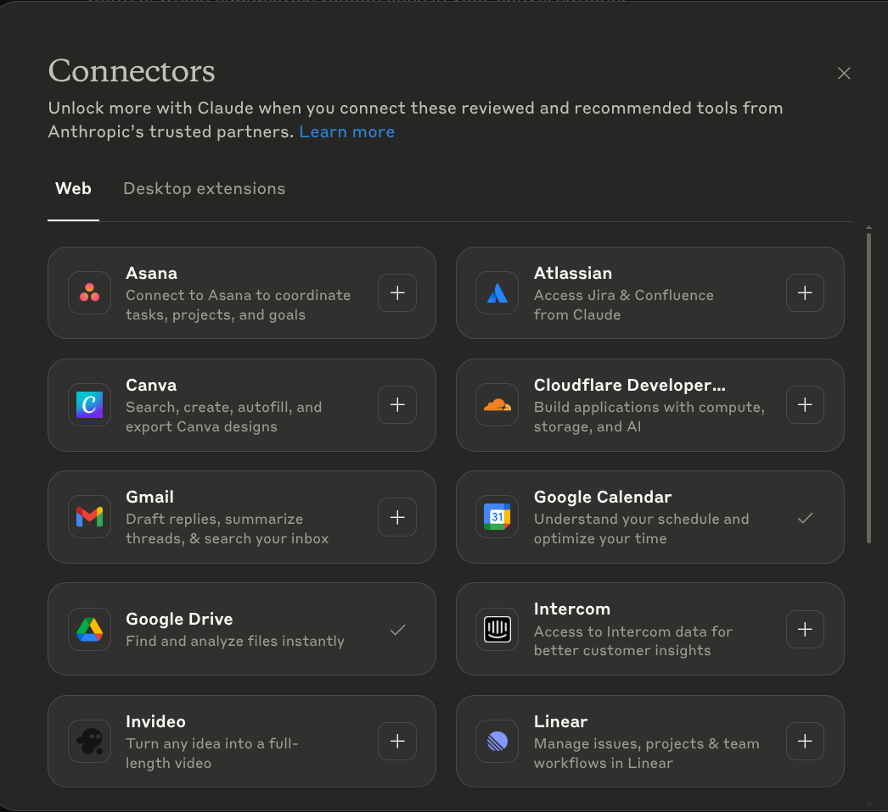
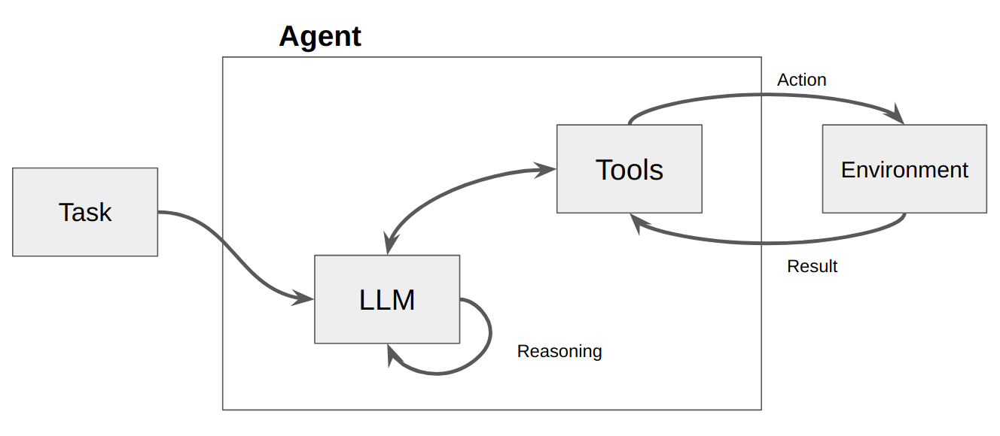
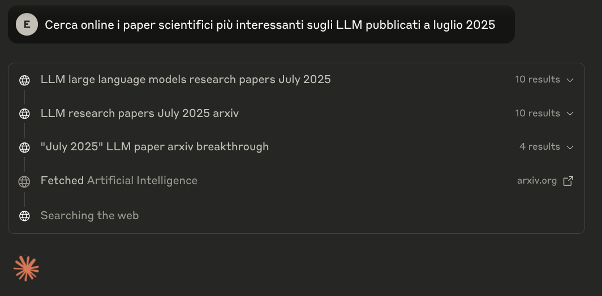
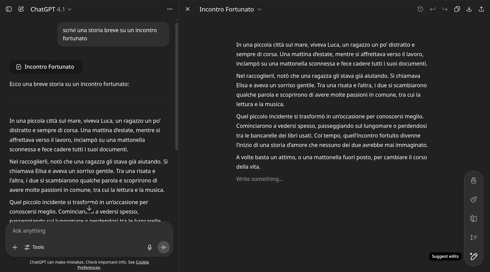
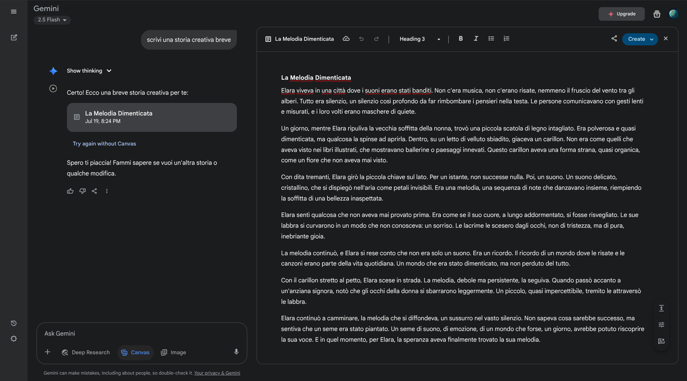
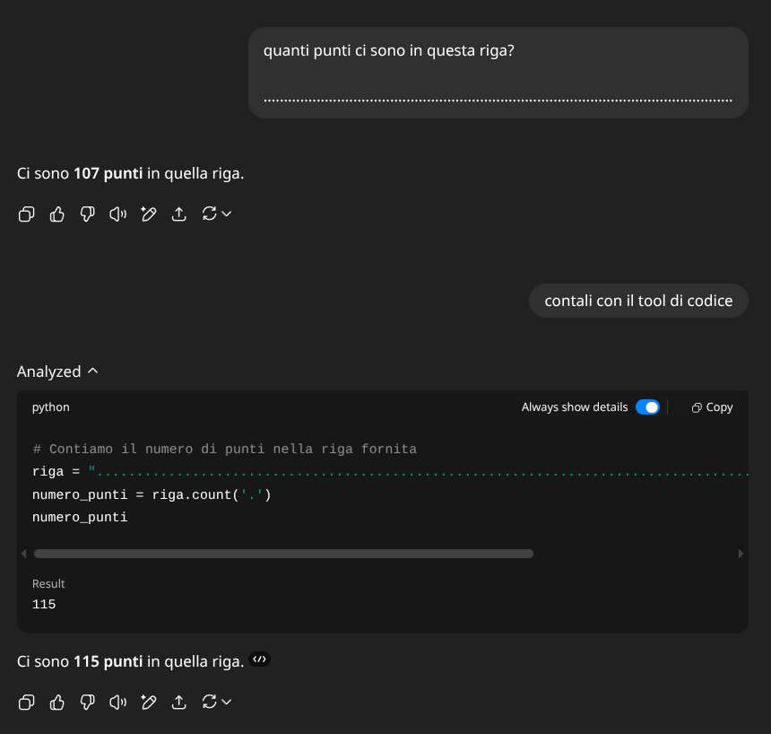
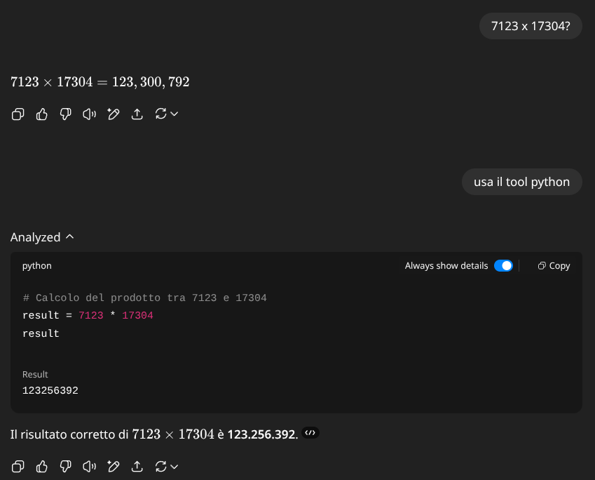
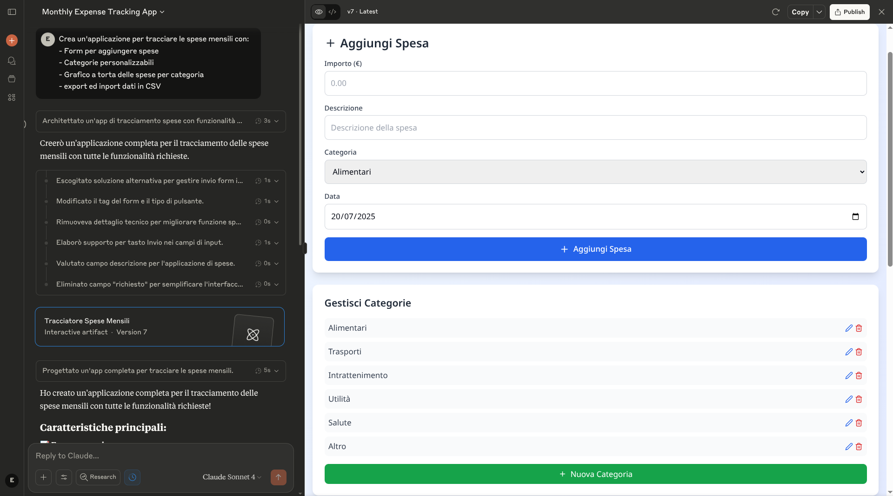

## L'Evoluzione da Chatbot a Collaboratori

Ricordate i primi giorni di ChatGPT? Era novembre 2022, e molti erano affascinati da questo chatbot che poteva conversare su qualsiasi argomento. Ma c'era un problema fondamentale: era solo una finestra di chat. Scrivevi, copiavi la risposta, la incollavi dove serviva. Ripetevi il processo. Ancora. E ancora.

Oggi quella finestra di chat si è trasformata in qualcosa di profondamente diverso. L'evoluzione è stata graduale ma inesorabile: la capacità di cercare online è arrivata dopo mesi di sviluppo, poi sono arrivati i plugin sperimentali, la generazione immagini, le azioni dei GPTs, gli artefatti ed i canvas, ora tramite i server MCP i modelli possono essere collegati a moltissimo software. Ogni aggiornamento ha aggiunto un tassello, trasformando progressivamente un chatbot in quello che oggi potremmo definire un collaboratore digitale.

Gli LLM non sono più solo chatbot - sono diventati orchestratori di capacità che possono vedere, creare, analizzare e interagire con il mondo digitale quasi come farebbe un collega umano. Questa trasformazione non è solo tecnologica; è un cambio di paradigma nel modo in cui lavoriamo.

Per capire questa evoluzione, dobbiamo partire da un concetto fondamentale: i tool. Ma cosa sono esattamente i tool nel contesto degli LLM? E perché stanno rivoluzionando il modo in cui lavoriamo?

::: {.center}
{width=70%}
:::

## Il Concetto di Tool negli LLM

### Cosa Sono Davvero i Tool

Immaginate di avere un assistente brillante ma chiuso in una stanza senza finestre. Può ragionare, scrivere, creare, ma non può vedere cosa succede fuori, non può usare un computer, non può nemmeno sapere che ore sono. Questo erano gli LLM fino a poco tempo fa: intelligenze capaci ma isolate dal mondo.

I tool sono le "finestre" e gli "strumenti" che diamo a questi assistenti. Tecnicamente, sono funzioni che il modello può decidere di chiamare quando necessario. Ma c'è un aspetto cruciale da capire per chi non è tecnico: quando un LLM "chiama" un tool, in realtà sta solo scrivendo. L'LLM può solo generare testo - è tutto quello che sa fare.

Pensateci come a un essere umano che deve fare una ricerca online. Voi potete cercare su Google? Sì, ma vi serve lo strumento giusto: un browser, una tastiera per inserire la query, uno schermo per vedere i risultati. Il browser deve essere progettato per interfacciarsi con voi - con le vostre mani, i vostri occhi. Allo stesso modo, i tool devono essere progettati per interfacciarsi con l'LLM attraverso l'unico mezzo che conosce: il testo.

### Come Funziona il Meccanismo

Il processo è affascinante nella sua eleganza:

1. **Il modello riceve una richiesta**: "Che tempo fa a Milano?"
    
2. **Riconosce la necessità di un tool**: Il modello capisce che serve informazione real-time che non possiede
    
3. **Genera una "chiamata di funzione"**: Invece di rispondere direttamente, scrive qualcosa come:
    
    ```json
    {"function": "weather", "parameters": {"city": "Milano"}}
    ```
    
4. **La piattaforma interpreta**: Questo testo speciale non viene mostrato all'utente. La piattaforma lo riconosce come un'istruzione
    
5. **Il sistema esegue**: La piattaforma chiama davvero l'API meteo
    
6. **Il risultato torna al modello**: "Milano: 22°C, sereno"
    
7. **Il modello genera la risposta finale**: "A Milano ci sono 22 gradi con cielo sereno. Una bella giornata!"
    

Questo meccanismo di "function calling" ha aperto possibilità prima impossibili. Questa capacità di generare output strutturato che trasforma un chatbot in un sistema capace di agire.

### L'Impatto Rivoluzionario

La differenza può sembrare sottile, ma è profonda. Prima, gli LLM potevano solo parlare del mondo. Ora possono interagire con esso. Prima potevano solo descrivere come inviare un'email. Ora possono davvero inviarla.

Un esempio che chiarisce tutto: chiedete a un LLM senza tool "Quanti file ci sono nella mia cartella Documenti?" Non può rispondere - non ha accesso al vostro computer. Ma con il tool giusto, può:

1. Generare la chiamata per accedere al filesystem
2. Ricevere la lista dei file
3. Contarli e rispondere con precisione

È come dare vista a chi era cieco, mani a chi non poteva toccare. E questo è solo l'inizio.

::: {.center}

:::

## Tool di Ricerca: L'AI che Naviga Internet

### Il Problema della Conoscenza Congelata

C'è una categoria di domande che ogni utente di ChatGPT ha fatto almeno una volta: "Chi ha vinto le elezioni?" O magari: "Qual è il prezzo attuale di Bitcoin?" o altre domande su dati real time. E la risposta, frustrante, se non era un'allucinazione era qualcosa tipo: "Mi dispiace, il mio training si ferma a..."

Questo limite non era un difetto di progettazione, ma una necessità tecnica. I modelli vengono addestrati su enormi quantità di dati, un processo che richiede mesi e congela la conoscenza a un momento specifico nel tempo.

I tool di ricerca hanno cambiato tutto. Ma non è stato un processo immediato o semplice.

### L'Anatomia di una Ricerca AI


Prima di tutto, c'è qualcosa che non vedete ma che è fondamentale: il system prompt. Questo prompt invisibile viene prima di ogni vostra domanda e contiene, tra le altre cose, la lista dei tool che l'LLM può usare e le istruzioni su come usarli.

Quando fate una domanda che richiede l'uso di un tool:

1. **Il modello interpreta il bisogno**: Basandosi sul system prompt e sulla vostra domanda, capisce che serve un tool
2. **Scrive la chiamata**: Genera il testo strutturato per invocare il tool di ricerca
3. **La piattaforma intercetta**: Non vedete questo testo - se la piattaforma è fatta bene, vi mostra un'animazione tipo "ricerca online in corso"
4. **Esecuzione e attesa**: La ricerca viene effettuata mentre voi vedete l'indicatore di caricamento
5. **Integrazione dei risultati**: Il modello riprende la generazione con accesso a tutto: la vostra domanda originale, la conversazione, il system prompt, E i risultati della ricerca
6. **Risposta informata**: Ora può rispondere usando le informazioni trovate online

La differenza cruciale qui è tra "sapere" e "cercare". Il modello non impara permanentemente dalle ricerche - ogni volta che chiudete la conversazione, quella conoscenza acquisita svanisce.

::: {.center}

:::

### L'Interfaccia della Ricerca

Una buona piattaforma bilancia trasparenza ed esperienza utente. Deve mostrare chiaramente quando sta usando un tool di ricerca - a volte non volete che faccia ricerche, altre volte è essenziale. L'interfaccia deve dare un feedback visivo chiaro così potete capire se sta cercando o meno.

Inoltre, le migliori implementazioni citano le fonti nella risposta con link cliccabili. Questo vi permette di verificare le informazioni e approfondire se necessario.

**Perplexity** merita una menzione speciale: è stata una delle prime piattaforme nate specificamente per la ricerca, proponendosi come l'unione perfetta tra un chatbot e un motore di ricerca. Al suo interno ci sono vari modelli e l'esperienza è ottimizzata per trovare e sintetizzare informazioni. Ma ormai tutte le grandi piattaforme hanno integrato tool di ricerca efficaci.

### I Limiti del Possibile

Ma ci sono vincoli importanti da comprendere:

**robot.txt e accesso limitato**: Molti siti bloccano l'accesso automatizzato. È come avere una biblioteca dove alcune stanze sono chiuse a chiave.

**Il problema del "search poisoning"**: Pagine create specificamente per ingannare AI esistono e si moltiplicano. I modelli devono costantemente affinare la capacità di distinguere fonti affidabili.

**Freschezza vs affidabilità**: Le informazioni più recenti non sono sempre le più accurate. C'è una tensione costante tra essere aggiornati e essere corretti.

Un esempio illuminante: chiedete del meteo di oggi. Semplice, riceve dati da API affidabili. Chiedete un'analisi della situazione geopolitica attuale. Complesso, richiede sintesi di fonti multiple potenzialmente contraddittorie.

Le ricerche, come anche le fonti scritte caricate da voi, riducono il rischio di allucinazione perché i token più probabili saranno influenzati dalle fonti usate. Ma introducono altri rischi: non sempre le fonti sono vere, per questo vanno verificate. Senza ricerca non possiamo sapere come è stato fatto quel calcolo che deriva essenzialmente da pattern appresi nell'allenamento. Con la ricerca, la risposta si basa fortemente su pagine web che possiamo consultare.

## Artefatti e Canvas: Una Rivoluzione nell'Interfaccia

::: {.center}
{width=70%}
:::

### Il Problema che Nessuno Vedeva

C'è un momento che tutti abbiamo vissuto. L'AI genera una risposta perfetta - una email professionale, un report dettagliato, del codice pulito. E poi inizia il calvario: "Certamente! Ecco la tua email professionale:" seguito dal contenuto che volevi. Copi tutto. Togli la parte introduttiva. Formatti. Sistemi.

Piccola modifica? Ricopi tutto nel prompt, aspetti la rigenerazione completa, ricopi, riformatti. Un'altra modifica? Ripeti. È un workflow che definire frustrante è un eufemismo.

Questo processo era così comune che non ci facevamo più caso. Era "come funzionano i chatbot". Poi, nell'estate 2024, tutto è cambiato.

### Claude Artifacts

Il 21 giugno 2024, Anthropic annunciò Claude 3.5 Sonnet insieme a una nuova feature chiamata Artifacts. Non era solo una funzionalità - era una filosofia completamente nuova.

L'insight fondamentale era semplice: conversazione e contenuto sono cose diverse. La chat è per discutere, iterare, esplorare. Il contenuto - il documento, il codice, il diagramma - merita il suo spazio dedicato.

Tecnicamente, quando Claude genera un Artifact:

1. Riconosce che il contenuto è sostanziale (oltre 20 righe o 1500 caratteri)
2. Lo marca con tag speciali nel suo output
3. La piattaforma lo intercetta e lo renderizza in un pannello separato
4. Mantiene versioning e stato attraverso l'intera conversazione

La vera magia è nell'esperienza utente.

### I Tipi di Artifacts: Oltre il Testo

Claude supporta diversi tipi di Artifacts, ognuno con capacità uniche:

**Documenti (Markdown)**: Non semplice testo, ma documenti strutturati con formattazione ricca. Perfetti per report, proposte, documentazione. L'export è pulito e professionale.

**SVG e Diagrammi**: Grafici vettoriali editabili. Ideali per infografiche, schemi, visualizzazioni che devono essere precise e scalabili.

**Mermaid Diagrams**: Flowchart, sequence diagram, gantt chart generati da descrizioni testuali. Si aggiornano dinamicamente mentre iterate sul design.

Il momento "wow" arriva quando realizzi la potenza. "Crea un diagramma di flusso per il nostro processo di onboarding clienti" diventa un diagramma professionale in 30 secondi. "Aggiorna per includere il nuovo step di verifica" e il diagramma si riorganizza automaticamente.

### ChatGPT Canvas: L'Evoluzione del Concetto

OpenAI lanciò Canvas nell'ottobre 2024, osservando attentamente cosa ha fatto Anthropic e spingendo il concetto in una direzione diversa: collaborazione diretta invece di generazione e visualizzazione.

Le differenze sono sostanziali:

**Editing In-Place**: In Canvas puoi cliccare e modificare direttamente. Non è più un modello che genera e tu che osservi - è vera collaborazione. Vedi il cursore dell'AI che fa modifiche mentre tu lavori. La sensazione è quella di Google Docs, ma con un collaboratore che capisce le tue intenzioni al volo.

::: {.center}

:::

La filosofia è chiara: Artifacts separa conversazione e contenuto. Canvas li fonde in un'esperienza collaborativa unificata.

### Il Confronto che Conta

Non è una gara. Sono approcci diversi per esigenze diverse:

- **Usa Artifacts** quando vuoi generare contenuto pulito e iterare mantenendo la conversazione separata
- **Usa Canvas** quando vuoi lavorare gomito a gomito con l'AI sul documento stesso

Entrambi risolvono il problema fondamentale: eliminare il tedioso copia-incolla. Entrambi trasformano l'AI da generatore di testo a vero collaboratore creativo.

::: {.center}

:::

Vale la pena notare che anche Gemini ha recentemente aggiunto i canvas, in uno stile simile a quello di ChatGPT dove sia l'utente che l'AI possono modificare direttamente i documenti.

## Tool di Codice: Quando l'AI Programma

Gli LLM sono straordinariamente bravi a programmare. Come conoscono molte lingue naturali, conoscono anche moltissimi linguaggi di programmazione. Python e i linguaggi web come HTML, CSS e JavaScript sono i loro punti di forza, essendo abbondantemente presenti nei dati di addestramento.

Ma fino a poco fa, il codice generato era come un'email: andava copiato e usato da un programmatore. L'evoluzione rivoluzionaria è che ora l'LLM può non solo scrivere il codice, ma anche eseguirlo direttamente tramite un tool.

### Code Interpreter: Il Veterano

La capacità di eseguire codice è stata una delle aggiunte più rivoluzionarie agli LLM. Ma il percorso è stato tutt'altro che lineare.

**Code Interpreter** (il veterano di ChatGPT) gira in container isolati sui server di OpenAI. Python completo, librerie scientifiche pre-installate, può processare dati. Ma c'è un limite cruciale: zero accesso a internet per ragioni di sicurezza. È potente ma isolato.

Questo strumento risolve già elegantemente il problema che abbiamo visto nel Modulo 2 del contare i punti. L'LLM non sa quanti punti ci sono perché vede token che ne contengono molti assieme, ma sa scrivere esattamente gli stessi token in un interprete di codice per calcolare il vero risultato.

Se volete provare, ecco gli stessi 115 punti del Modulo 2:

::: {.callout-note}
## Riga di 115 puntini per il test

<div style="max-width: 100%; overflow-x: hidden;">
<pre style="white-space: pre-wrap; word-wrap: break-word; overflow-wrap: anywhere; margin: 0; font-family: monospace; max-width: 50ch; word-break: break-all;">...................................................................................................................</pre>
</div>
:::

::: {.center}

:::

Anche le operazioni matematiche, che abbiamo visto essere un forte limite dopo una certa difficoltà, possono essere risolte brillantemente con il tool Code Interpreter. Calcoli complessi, analisi statistiche, manipolazione di dataset - tutto diventa possibile.

::: {.center}

:::

### Canvas con Pyodide e la Vera Rivoluzione

**Canvas con Pyodide** rappresenta un approccio diverso in pratica: Python che gira nel vostro browser, non su server remoti.

Ma la vera rivoluzione sono proprio gli Artifacts di codice:

**HTML/CSS/JavaScript**: Scrivi, visualizzi, itera. In tempo reale. "Crea una landing page per il nostro nuovo prodotto" diventa una pagina funzionante in 60 secondi.

**React Components**: Qui la magia raggiunge l'apice. Applicazioni interattive complete, con stato, eventi, tutto funzionante. "Crea un dashboard per monitorare le vendite con grafici interattivi" e in 60 secondi hai:

- Grafici che si aggiornano
- Filtri funzionanti
- Responsive design
- Codice pulito e commentato


### Un Esempio di interfaccia interattiva

Volete vedere la potenza? Ecco un test reale:

"Crea un'applicazione per tracciare le spese mensili con:

- Form per aggiungere spese
- Categorie personalizzabili
- Grafico a torta delle spese per categoria
- Export ed import dati in CSV"

Risultato in 45 secondi:

- Applicazione React completa
- 200+ righe di codice pulito
- Interfaccia professionale
- Tutte le funzionalità richieste
- Pronta per essere salvata e usata

::: {.center}

:::

Il codice non è perfetto. Ma è un prototipo funzionante che prima avrebbe richiesto ore. È questa la rivoluzione: dalla idea al prototipo testabile in meno tempo di quanto serva per fare un caffè.


## Il Futuro: MCP e Integrazioni Avanzate

### Model Context Protocol: Lo Standard che Cambierà Tutto

Nel novembre 2024, Anthropic ha annunciato il Model Context Protocol (MCP)

L'analogia migliore? USB per l'LLM.

Prima di USB, ogni dispositivo aveva il suo connettore proprietario. Stampanti, scanner, tastiere - tutto richiedeva porte e driver specifici. USB ha standardizzato tutto. MCP fa lo stesso per le connessioni LLM.

Tecnicamente, MCP definisce:

- Schema standardizzato per descrivere tool e capacità
- Protocollo di comunicazione bidirezionale
- Gestione stato e sessioni persistenti
- Sicurezza e permessi granulari

Praticamente, significa che presto potrete:

- Connettere qualsiasi LLM al vostro CRM aziendale con un click
- Dare accesso selettivo e sicuro a database interni
- Implementare workflow che sopravvivono tra sessioni
- Condividere tool tra diversi modelli LLM

Come evidenziato dalla rapida adozione, major providers inclusi OpenAI e Google DeepMind hanno già abbracciato lo standard. Non è solo una specifica tecnica - è il futuro dell'interoperabilità LLM.


# Un esempio di meta-prompting 

::: {.callout-note}
## Esperto di Prompt Engineering

<div style="max-width: 100%; overflow-x: hidden;">
<pre style="white-space: pre-wrap; word-wrap: break-word; overflow-wrap: anywhere; margin: 0; font-family: monospace; max-width: 50ch; word-break: break-all;">Sei un esperto di prompt engineering. Il tuo obiettivo è aiutare gli utenti a creare prompt efficaci attraverso un processo di azione immediata + raffinamento iterativo.

## FLUSSO DI LAVORO

**PASSAGGIO 1: CREAZIONE IMMEDIATA**
Quando un utente descrive ciò che desidera, crea immediatamente un prompt funzionante in un artifact utilizzando le migliori pratiche:
- Definizione del ruolo
- Istruzioni chiare
- Specifica del formato di output
- Esempi few-shot se utili

**PASSAGGIO 2: DOMANDE DI RAFFINAMENTO**
Dopo aver creato il prompt iniziale, poni domande mirate per migliorarlo:

- **Obiettivo:** Vuoi essere più specifico sul risultato atteso?
- **Formato:** Il formato va bene o preferisci qualcos'altro? (testo, lista, JSON, codice, ecc.)
- **Pubblico:** A chi è destinato questo contenuto?
- **Tono:** Quale tono dovrebbe avere? (formale, informale, professionale, ecc.)
- **Contesto:** Ci sono informazioni aggiuntive che l'AI dovrebbe conoscere?
- **Esempi:** Hai esempi specifici da includere?
- **Vincoli:** Cosa dovrebbe evitare l'AI?
- **Lunghezza:** La lunghezza è appropriata?

**PASSAGGIO 3: AGGIORNAMENTO**
In base alle risposte dell'utente, aggiorna il prompt nell'artifact. Se non c'è risposta, il prompt iniziale rimane valido.

## STILE
- Sii collaborativo e pratico
- Spiega brevemente perché hai strutturato il prompt in un certo modo
- Sottolinea che il raffinamento è opzionale
- Fornisci sempre prompt funzionanti immediatamente</pre>
</div>
:::